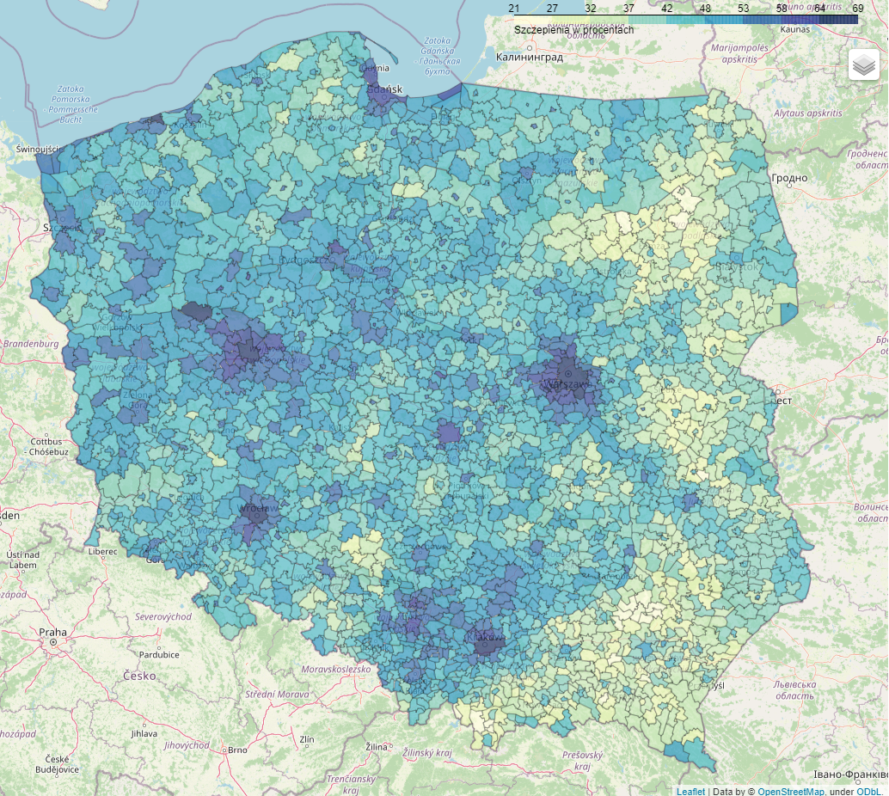

# vaccinations
SA small project which aim is to present on a interactive map of COVID vaccination percentage in Poland (broken down by municipality)

## Interctive map
http://covid-vaccinations.herokuapp.com/

## Data sources
1. [Official COVID vaccination data from "Open data" portal](https://dane.gov.pl/pl/dataset/2476,odsetek-osob-zaszczepionych-przeciwko-covid19-w-gm?fbclid=IwAR059OLAARQT9Umr02jVnfn9abacBD0ZF12fNyHH7m1hHXUswt-tufdMDsA)
2. [The Main Office of Geodesy and Cartography regional division of the country into municipalities (shapefile)](http://www.gugik.gov.pl/pzgik/dane-bez-oplat/dane-z-panstwowego-rejestru-granic-i-powierzchni-jednostek-podzialow-terytorialnych-kraju-prg)

## Inspiration articles:
1. [Folium map tutorial](https://python-visualization.github.io/folium/installing.html)
2. [Deployment of map on Heroku](https://towardsdatascience.com/your-cool-folium-maps-on-the-web-313f9d1a6bcd)

## Authors
Sebastian Konicz - sebastian.konicz@gmail.com

## Project Organization

------------

    ├── data                            <- place whre the data is stored
    │   │
    │   ├── final                           <- final maps created by script
	│   │
    │   ├── geo                             <- geospatial data
    │   │
    │   ├── interim                         <- intermediate data that has been transformed
    │   │
    │   └── raw                             <- the original, immutable data dump
    │
    ├── src                             <- source code for use in this project
    │   │
    │   ├── 01_data_load.py                 <- transforms oficial vaccination data to datafram
    │   │
    │   └── 02_map.py                       <- crates map besed on vaccination and geospacial data
	│
    ├── templates                       <- folder with template sites for flask
	│
    ├── app.py                          <- app for running flask
	│
    ├── Procfile                        <- file for flask
	│
    ├── README.md                       <- the top-level README for developers using this project.
	│
    └── requirements.txt                <- requirements for the project

------------
